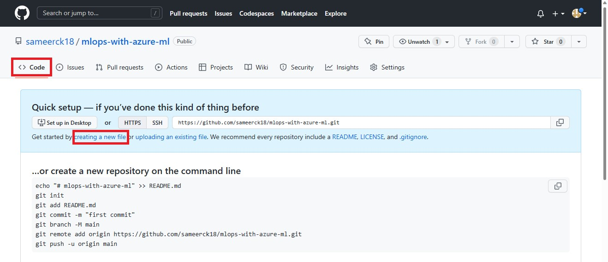
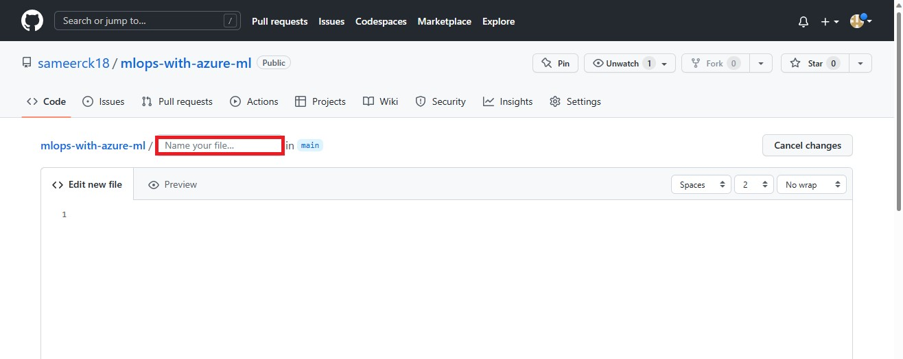
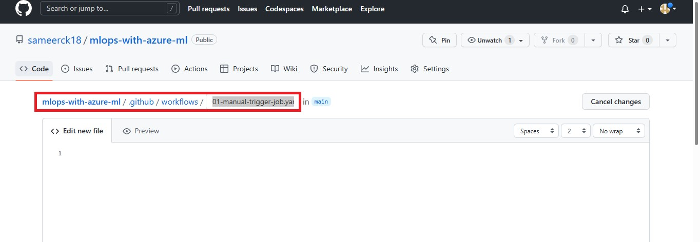

# Triggering Azure Machine Learning jobs with GitHub Actions

Automation is an important part in machine learning operations (MLOps). Similar to DevOps, MLOps allows for rapid development and delivery of machine learning artifacts to consumers of those artifacts. An effective MLOps strategy allows for the creation of automated workflows to train, test, and deploy machine learning models while also ensuring model quality is maintained.

Here we are using GitHub Actions for automating workflows and running Azure ML jobs.

## What is GitHub Actions ?

GitHub Actions is a continuous integration and continuous delivery (CI/CD) platform that allows you to automate your build, test, and deployment pipeline. You can create workflows that build and test every pull request to your repository, or deploy merged pull requests to production.

### The components of GitHub Actions

You can configure a GitHub Actions *workflow* to be triggered when an *event* occurs in your repository, such as a pull request being opened or an issue being created. Your workflow contains one or more *jobs* which can run in sequential order or in parallel. Each job will run inside its own virtual machine *runner*, or inside a container, and has one or more steps that either run a script that you define or run an *action*, which is a reusable extension that can simplify your workflow.

### Workflows

A workflow is a configurable automated process that will run one or more jobs. Workflows are defined by a YAML file checked in to your repository and will run when triggered by an event in your repository, or they can be triggered manually, or at a defined schedule.

Workflows are defined in the ```.github/workflows``` directory in a repository, and a repository can have multiple workflows, each of which can perform a different set of tasks. For example, you can have one workflow to build and test pull requests, another workflow to deploy your application every time a release is created, and still another workflow that adds a label every time someone opens a new issue.

### Events

An event is a specific activity in a repository that triggers a workflow run. For example, activity can originate from GitHub when someone creates a pull request, opens an issue, or pushes a commit to a repository. You can also trigger a workflow run on a schedule, by posting to a REST API, or manually.

### Jobs

A job is a set of steps in a workflow that execute on the same runner. Each step is either a shell script that will be executed, or an action that will be run. Steps are executed in order and are dependent on each other. Since each step is executed on the same runner, you can share data from one step to another. For example, you can have a step that builds your application followed by a step that tests the application that was built.

You can configure a job's dependencies with other jobs; by default, jobs have no dependencies and run in parallel with each other. When a job takes a dependency on another job, it will wait for the dependent job to complete before it can run. For example, you may have multiple build jobs for different architectures that have no dependencies, and a packaging job that is dependent on those jobs. The build jobs will run in parallel, and when they have all completed successfully, the packaging job will run.

### Actions

An action is a custom application for the GitHub Actions platform that performs a complex but frequently repeated task. Use an action to help reduce the amount of repetitive code that you write in your workflow files. An action can pull your git repository from GitHub, set up the correct toolchain for your build environment, or set up the authentication to your cloud provider.

### Runners

A runner is a server that runs your workflows when they're triggered. Each runner can run a single job at a time. GitHub provides Ubuntu Linux, Microsoft Windows, and macOS runners to run your workflows; each workflow run executes in a fresh, newly-provisioned virtual machine.

## Prerequisites

- Azure Subscription
- Azure Machine Learning workspace and Compute Cluster

## Learning Objectives

- Create a GitHub Repository
- Create a service principal needed to run an Azure Machine Learning job
- Store Azure credentials securely using secrets in GitHub
- Create a GitHub Action using YAML that uses the stored Azure credentials to run an Azure Machine Learning job

## Exercise 1: Create a GitHub Account and Repository

1. Browse to [GitHub](https://github.com). If you already have an account click on **"Sign in"** and open your GitHub Account. If you don't have an account then click on **"Sign up"** at the top-right corner.

    

2. Enter your email address, create a password and give a unique username for your GitHub Account. Click **continue.**

    

4. verify your account by solving a puzzle and click on **create account.**

5. Next you will receive a GitHub Launch Code to your email address. Enter the code and your GitHub account is ready.

    

6. Your GitHub Homepage will looks like below. Click on **Create repository**.

    
    
7. Give a Repository name (For ex - ```mlops-with-azure-ml```). Make it **Public** repository. And Click on **Create repository** button at the bottom.

    
    
8.  ```mlops-with-azure-ml``` Repository is created. Now navigate to **<> Code** and click on **creating a new file**.

    
    
9. Now, Create a directory by giving ```.github/workflows/``` in the **Name your file...** field.

    
    
10. Now give ```01-manual-trigger-job.yaml``` to create a yaml file, which we will use in this module to trigger azure machine learning job through GitHub Actions. Scroll down at the bottom and Click on **Commit new file**.

   
   
    
11. Click on **Add file** and select **Create new file** to create one more directory with the name ```src/model/``` and create a ```main.py``` file, which will be the python script you created in the previous module to train model. Copy-paste the entire code from that script file. And Click on **Commit new file** at the bottom of the page.
    
    
    
    
12. Go to ```src``` folder and click on **Add file** and select **Create new file** to create one job with the name ```job.yaml```. And Click **Commit**.
    
    
    
    

[ ⏮️ Previous Module](../1_using-an-azure-machine-learning-job-for-automation/documentation.md) - [Next Module ⏭️ ](../3_triggering-github-actions-with-trunk-based-development/documentation.md)
