# Triggering Azure Machine Learning jobs with GitHub Actions

Automation is an important part in machine learning operations (MLOps). Similar to DevOps, MLOps allows for rapid development and delivery of machine learning artifacts to consumers of those artifacts. An effective MLOps strategy allows for the creation of automated workflows to train, test, and deploy machine learning models while also ensuring model quality is maintained.

Here we are using GitHub Actions for automating workflows and running Azure ML jobs.

## What is GitHub Actions ?

GitHub Actions is a continuous integration and continuous delivery (CI/CD) platform that allows you to automate your build, test, and deployment pipeline. You can create workflows that build and test every pull request to your repository, or deploy merged pull requests to production.

### The components of GitHub Actions

You can configure a GitHub Actions *workflow* to be triggered when an *event* occurs in your repository, such as a pull request being opened or an issue being created. Your workflow contains one or more *jobs* which can run in sequential order or in parallel. Each job will run inside its own virtual machine *runner*, or inside a container, and has one or more steps that either run a script that you define or run an *action*, which is a reusable extension that can simplify your workflow.

### Workflows

A workflow is a configurable automated process that will run one or more jobs. Workflows are defined by a YAML file checked in to your repository and will run when triggered by an event in your repository, or they can be triggered manually, or at a defined schedule.

Workflows are defined in the ```.github/workflows``` directory in a repository, and a repository can have multiple workflows, each of which can perform a different set of tasks. For example, you can have one workflow to build and test pull requests, another workflow to deploy your application every time a release is created, and still another workflow that adds a label every time someone opens a new issue.

### Events

An event is a specific activity in a repository that triggers a workflow run. For example, activity can originate from GitHub when someone creates a pull request, opens an issue, or pushes a commit to a repository. You can also trigger a workflow run on a schedule, by posting to a REST API, or manually.

### Jobs

A job is a set of steps in a workflow that execute on the same runner. Each step is either a shell script that will be executed, or an action that will be run. Steps are executed in order and are dependent on each other. Since each step is executed on the same runner, you can share data from one step to another. For example, you can have a step that builds your application followed by a step that tests the application that was built.

You can configure a job's dependencies with other jobs; by default, jobs have no dependencies and run in parallel with each other. When a job takes a dependency on another job, it will wait for the dependent job to complete before it can run. For example, you may have multiple build jobs for different architectures that have no dependencies, and a packaging job that is dependent on those jobs. The build jobs will run in parallel, and when they have all completed successfully, the packaging job will run.

### Actions

An action is a custom application for the GitHub Actions platform that performs a complex but frequently repeated task. Use an action to help reduce the amount of repetitive code that you write in your workflow files. An action can pull your git repository from GitHub, set up the correct toolchain for your build environment, or set up the authentication to your cloud provider.

### Runners

A runner is a server that runs your workflows when they're triggered. Each runner can run a single job at a time. GitHub provides Ubuntu Linux, Microsoft Windows, and macOS runners to run your workflows; each workflow run executes in a fresh, newly-provisioned virtual machine.

## Prerequisites

- Azure Subscription
- Azure Machine Learning workspace and Compute Cluster
- User Access Administrator role to create Service principal

## Learning Objectives

- Create a GitHub Repository
- Create a service principal needed to run an Azure Machine Learning job
- Store Azure credentials securely using secrets in GitHub
- Create a GitHub Action using YAML that uses the stored Azure credentials to run an Azure Machine Learning job
- Manually trigger the workflow.

## Exercise 1: Create a GitHub Account and Repository

1. Browse to [GitHub](https://github.com). If you already have an account click on **"Sign in"** and open your GitHub Account. If you don't have an account then click on **"Sign up"** at the top-right corner.

    

2. Enter your email address, create a password and give a unique username for your GitHub Account. Click **continue.**

    

4. Verify your account by solving a puzzle and click on **create account.**

5. Next you will receive a GitHub Launch Code to your email address. Enter the code and your GitHub account is ready.

    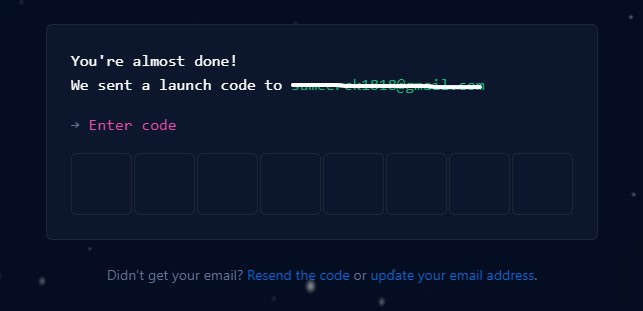

6. Your GitHub Homepage will looks like below. Click on **Create repository**.

    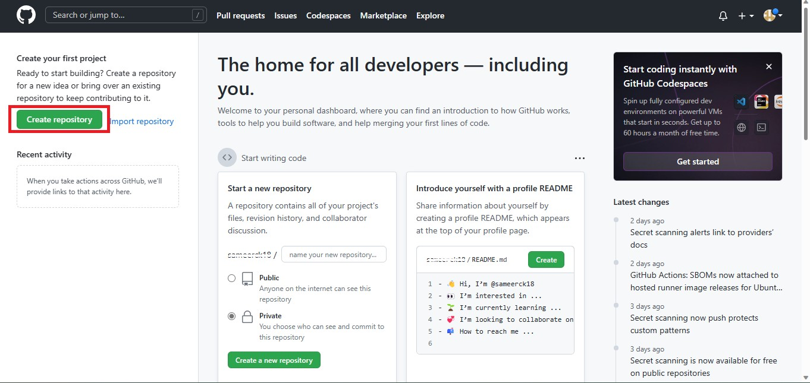
    
7. Give a Repository name (For ex - ```mlops-with-azure-ml```). Make it **Public** repository. And Click on **Create repository** button at the bottom.

    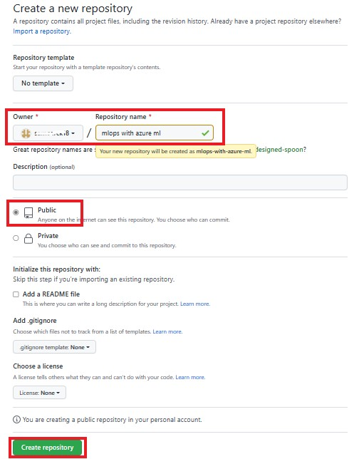
    
8.  ```mlops-with-azure-ml``` Repository is created. Now navigate to **<> Code** and click on **creating a new file**.

    
    
9. Now, Create a directory by giving ```.github/workflows/``` in the **Name your file...** field.

    
    
10. Now give ```01-manual-trigger-job.yaml``` to create a yaml file, which we will use in this module to trigger azure machine learning job through GitHub Actions. Copy paste the below code as file content after replacing ```<resource group name>``` and ```<Azure ML workspace name>``` with your **resource group** and **Azure ML workspace** names from Azure Portal. Scroll down at the bottom and Click on **Commit new file**.

    
   
    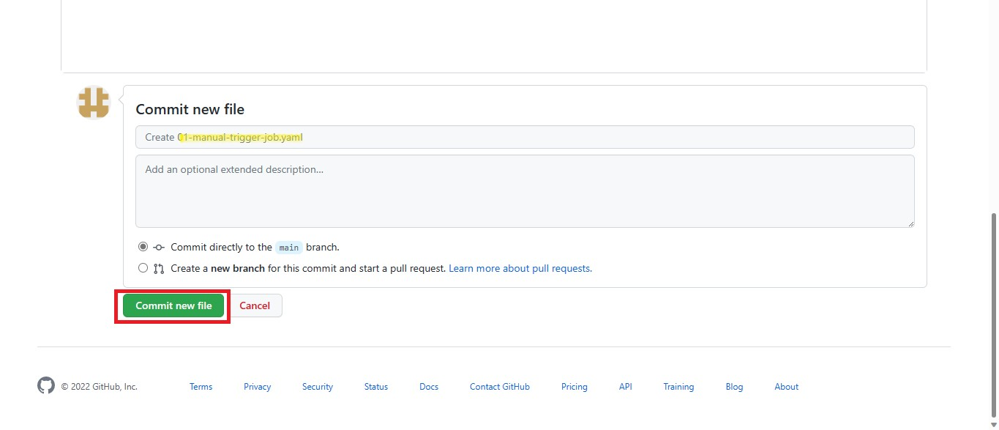
   
    ```yaml
    name: Manually trigger an Azure Machine Learning job

    on: 
      workflow_dispatch:

    jobs:
      train:
        runs-on: ubuntu-latest
        steps:
        - name: Check out repo
          uses: actions/checkout@main
        - name: Install az ml extension
          run: az extension add -n ml -y
        - name: Azure login
          uses: azure/login@v1
          with:
            creds: ${{secrets.AZURE_CREDENTIALS}}
        - name: run ml job
          run: az ml job create --file job.yaml --resource-group <resource group name> --workspace-name <Azure ML workspace name>
          working-directory: src
    ```

11. Navigate to **<> Code**  and click on **Add file** and select **Create new file** to create one more directory with the name ```src/model/``` and create a ```main.py``` file, which will be the python script you created in the previous module to train model. Copy-paste the python code from the main.py script created in Azure ML workspace. And Click on **Commit new file** at the bottom of the page.
    
    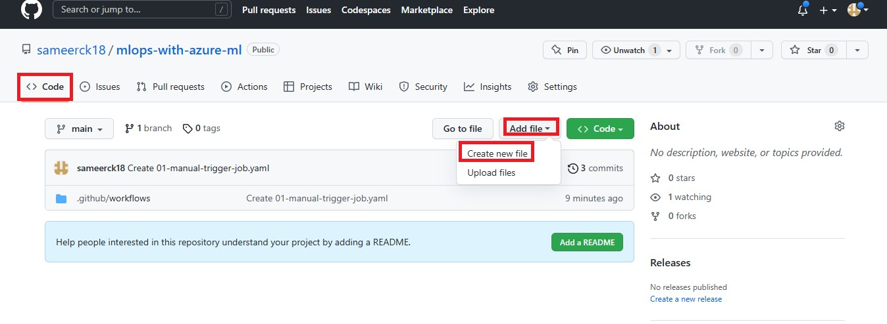
    
    
    
12. Go to ```src``` folder and click on **Add file** and select **Create new file** to create a Azure ML job with the name ```job.yaml```, which will be the same job you defined in previous module. Only change will be the ```code``` and **cluster name**. Here change it to ```model``` because the ```main.py``` is in model directory. And we will use **Compute Cluster** instead of **Cluster Instance**. Because, GitHub is authenticated to use your Azure Machine Learning workspace with a service principal. The service principal is only allowed to submit jobs that use a compute cluster, not a compute instance. You can get compute cluster name from your ML Workspace in **Compute** under **Compute Clusters** starting with **cluster{\*}**. Replace the instance name with cluster name and Paste. Click **Commit**.

    
   
    
   
    ```yaml
    $schema: https://azuremlschemas.azureedge.net/latest/commandJob.schema.json
    code: model
    command: >-
      python main.py 
      --training_data ${{inputs.training_data}}
    inputs:
      training_data: 
        path: azureml:nyc-taxi-data:1
        mode: ro_mount  
    environment: azureml:AzureML-sklearn-0.24-ubuntu18.04-py37-cpu@latest
    compute: cluster20230111T062714Z
    experiment_name: nyc-taxi-fare-prices
    description: Train a classification model on nyc taxi data to predict taxi fare prices.
    ```    

## Exercise 2: Create a service principal needed to run an Azure Machine Learning job

<ins>**Note**</ins>: This exercise is for your information only. <ins>You will not be able to create a service principal and assign a role to it</ins> in the lab environment. Instead, the Cloud Academy lab environment has done this for you and the required JSON output is provided at the end of the exercise.

When you use GitHub Actions to automate Azure Machine Learning jobs, you need to use a service principal to authenticate GitHub to manage the Azure Machine Learning workspace. For example, to train a model using Azure Machine Learning compute, you or any tool that you use, needs to be authorized to use that compute.

You can create a service principal, using the Cloud Shell in the Azure portal, which has contributor access to your resource group using the following command:
    
```bash
az ad sp create-for-rbac --name "<service-principal-name>" --role contributor --scopes /subscriptions/<subscription-id>/resourceGroups/<your-resource-group-name> --sdk-auth
```
- The output of the service principal should be a JSON with the following structure.
- The output for the service principal created by the Cloud Academy lab environment for your current lab session is below:

```
{
"clientId": "{LabStep.clientId}",
"clientSecret": "{LabStep.clientSecret}",
"subscriptionId": "{LabStep.subscriptionId}",
"tenantId": "{LabStep.tenantId}",
"activeDirectoryEndpointUrl": "https://login.microsoftonline.com",
"resourceManagerEndpointUrl": "https://management.azure.com/",
"activeDirectoryGraphResourceId": "https://graph.windows.net/",
"sqlManagementEndpointUrl": "https://management.core.windows.net:8443/",
"galleryEndpointUrl": "https://gallery.azure.com/",
"managementEndpointUrl": "https://management.core.windows.net/"
}
```

## Exercise 3: Store Azure credentials securely using secrets in GitHub

The Azure credentials you need to authenticate should not be stored in your code or plain text and should instead be stored in a GitHub secret.

To add a secret to your GitHub repository:

1. Navigate to the **Settings** tab. In the **Settings** tab, under **Security**, expand the **Secrets and variables** option and select **Actions**.

    

2. Click on **New repository secret** to create a new secret.

    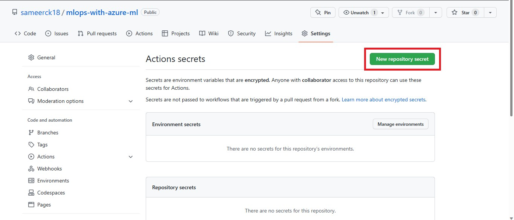

3. Enter your Azure credentials i.e., the output of the service principal as a **secret** and **name** the secret ```AZURE_CREDENTIALS```. Click **Add secret**.

    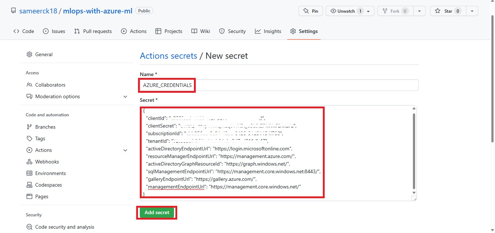
    
4. To use a secret containing Azure credentials in a GitHub Action, refer to the secret in the YAML file. For example - 

```yaml
on: [push]

name: Azure Login Sample

jobs:
  build-and-deploy:
    runs-on: ubuntu-latest
    steps:
      - name: Log in with Azure
        uses: azure/login@v1
        with:
          creds: '${{secrets.AZURE_CREDENTIALS}}'
```

## Exercise 4: Create a GitHub Action using YAML that uses the stored Azure credentials to run an Azure Machine Learning job

To define a workflow, you'll need to create a YAML file. You can trigger the workflow to train a model manually or with a push event. Manually triggering the workflow is ideal for testing, while automating it with an event is better for automation.

To configure a GitHub Actions workflow so that you can trigger it manually, use ```on: workflow_dispatch```. To trigger a workflow with a push event, use ```on: [push]```.

Once the GitHub Actions workflow is triggered, you can add various steps to a job. For example, you can use a step to run an Azure Machine Learning job:
    
```yaml
name: Manually trigger an Azure Machine Learning job

on: 
  workflow_dispatch:

jobs:
  train:
    runs-on: ubuntu-latest
    steps:
    - name: Check out repo
      uses: actions/checkout@main
    - name: Install az ml extension
      run: az extension add -n ml -y
    - name: Azure login
      uses: azure/login@v1
      with:
        creds: ${{secrets.AZURE_CREDENTIALS}}
    - name: run ml job
      run: az ml job create --file job.yaml --resource-group <resource group name> --workspace-name <Azure ML workspace name>
      working-directory: src
```

## Exercise 5: Manually trigger the workflow

1. To trigger the workflow, navigate to Actions. On the left, under **All workflows**, you will see a workflow with name ```Manually trigger an Azure Machine Learning job```. Click on it.

    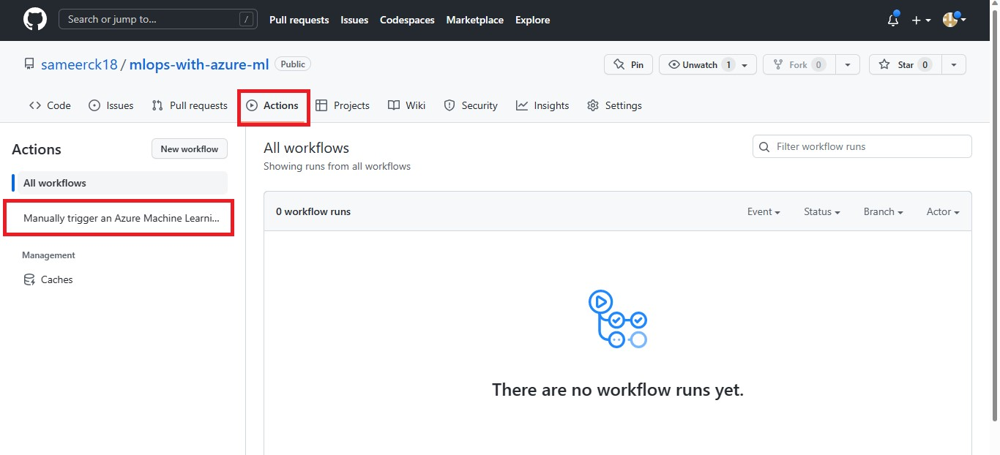

2. Now on the right, click **Run workflow**.

    
    
3. Open the workflow ```Manually trigger an Azure Machine Learning job``` whose status is **In progress**.

    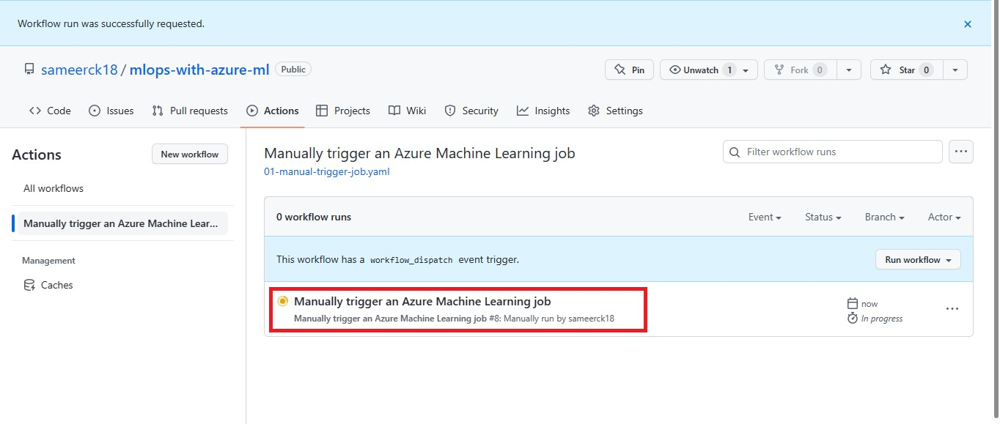
    
4. Now click on ```train``` under **Jobs**.

    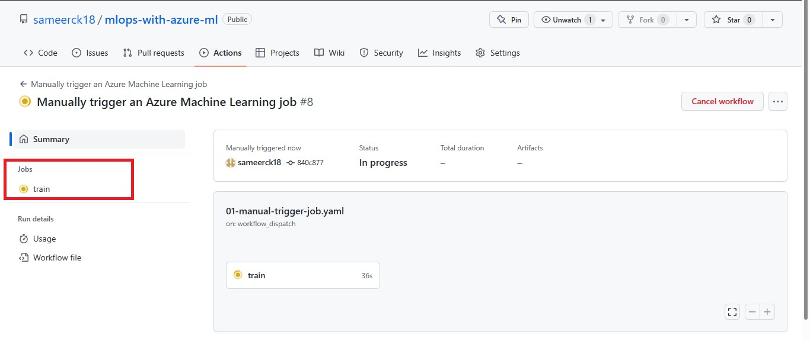
    
5. Once the workflow runs successfully, you will see the below page.

    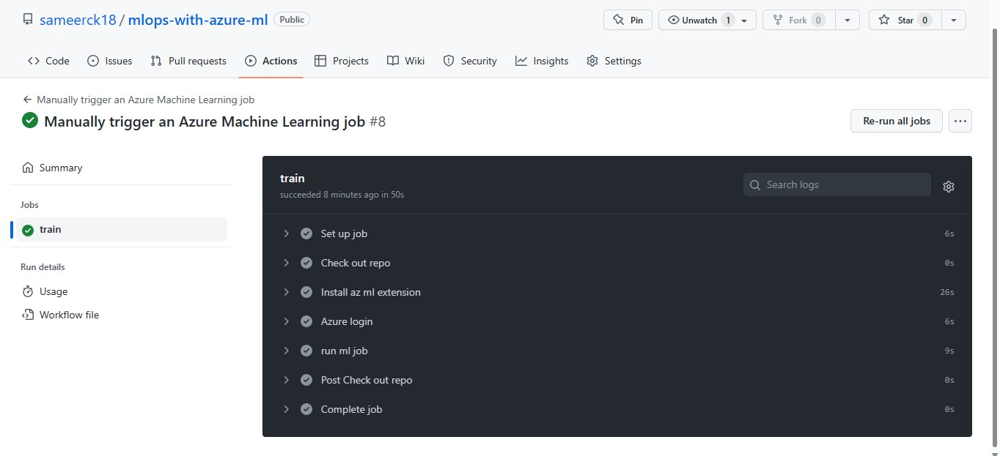
    
6. Go to your Azure ML workspace to see the job run.

    

7. Open the job to view more details.

    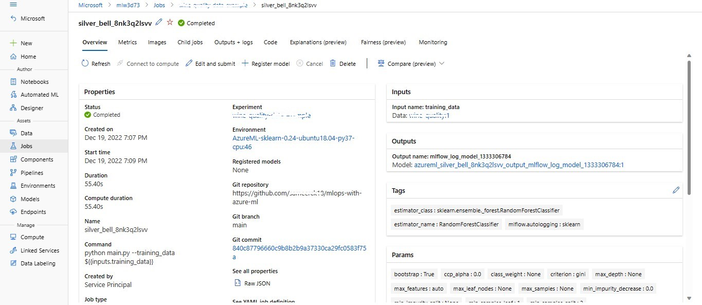

