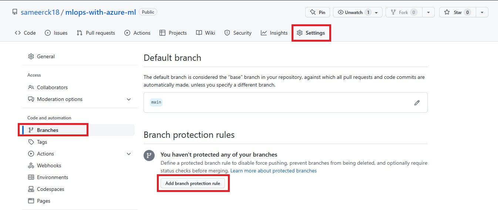
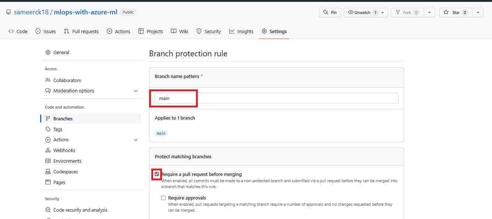
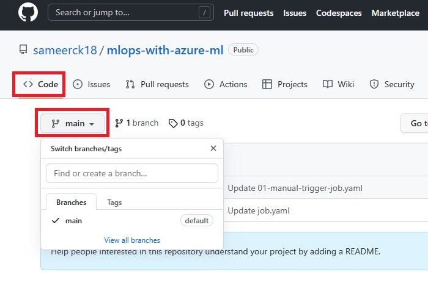
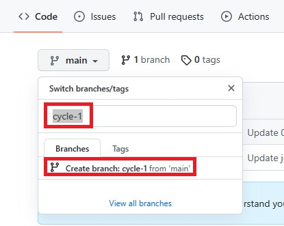
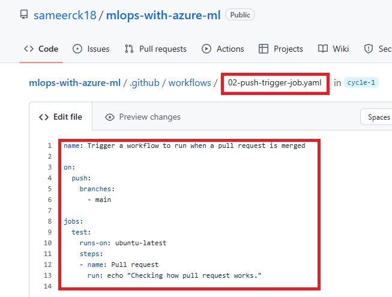
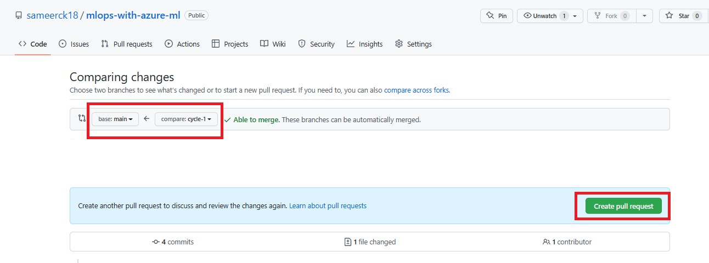
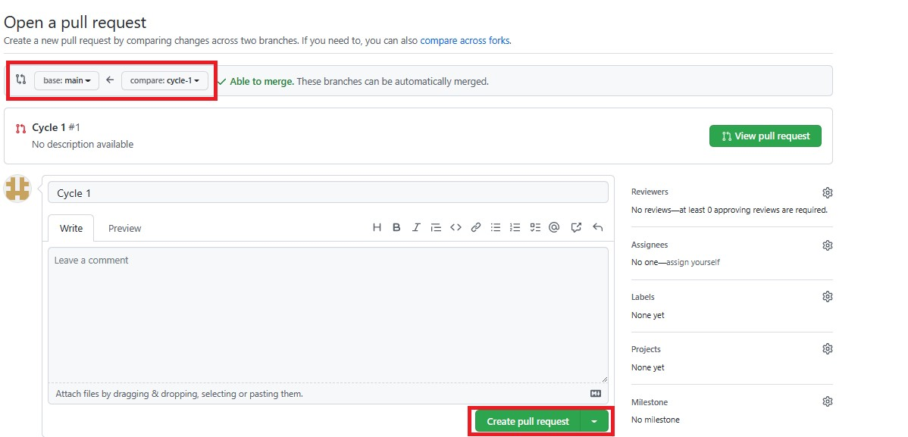
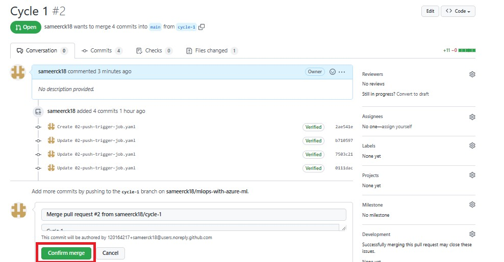
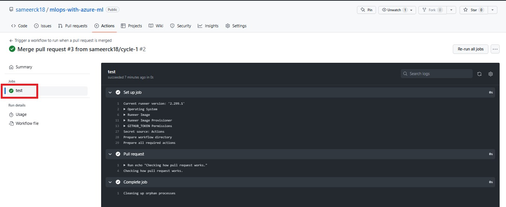
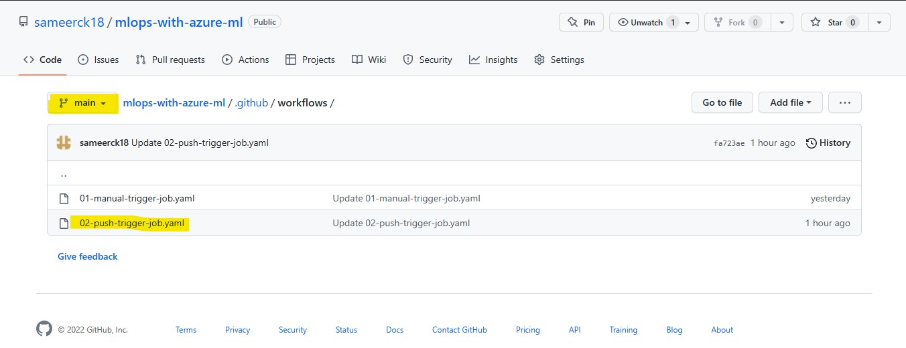

# Triggering GitHub Actions with trunk-based development

**Automation** is one of the most important practices of machine learning operations (MLOps). By automating tasks, you can deploy new models to production more quickly.

Next to automation, another key aspect of MLOps is **source control** to manage code and track any changes. 

Together, you can use automation and source control to trigger tasks in the machine learning workflow based on changes to the code. However, you want the automated task to be triggered only when the code changes have been verified and approved.

For example, after retraining a model using new hyperparameter values, you want to update the hyperparameter in the source code. After verifying and approving the change to the code that is used to train the model, you want to trigger the new model to be trained.

GitHub is a platform that offers GitHub Actions for automation and repositories using Git for source control. You can configure your GitHub Actions workflows to be triggered by a change in your repo.

## What is Trunk-based development ?

Trunk-based development is a version control management practice where developers merge small, frequent updates to a core “trunk” or main branch. Since it streamlines merging and integration phases, it helps achieve CI/CD and increases software delivery and organizational performance.

Developers can create short-lived branches with a few small commits compared to other long-lived feature branching strategies. As codebase complexity and team size grow, trunk-based development helps keep production releases flowing.

To set up trunk-based development, you'll want to:

- Block any direct pushes to the main branch.
- Work with pull requests whenever an update to the code is needed.
- Trigger code quality checks whenever a pull request is created to automatically verify the code.
- Merge a pull request only when changes are approved manually.

## Prerequisites

- Azure Subscription
- Azure Machine Learning workspace and Compute Cluster
- GitHub Account 

## Learning Objectives

- Create a branch protection rule to block direct pushes to main.
- Create a branch to update the code.
- Trigger a GitHub Actions workflow when opening a pull request.

## Exercise 1: Create a branch protection rule to block direct pushes to main

To protect your code, you want to block any direct pushes to the main branch. Blocking direct pushes means that no one will be allowed to directly push any code changes to the main branch. Instead, changes to the main branch can be made by merging pull requests.

To protect the main branch, enable a branch protection rule in GitHub:

1. Navigate to the **Settings** tab in your repo. In the **Settings** tab, under **Code and automation**, select **Branches**. Select **Add branch protection rule**.

    

2. Enter ```main``` under **Branch name pattern**. Enable only **Require a pull request before merging**. Save your changes by clicking **Create** at the bottom.

    

## Exercise 2: Create a branch to update the code

Whenever you want to edit the code, you'll have to create a branch and work in there. Once you want to make your changes final, you can create a pull request to merge the feature branch with the main branch.

1. Navigate to the **Code** tab in your repo. In the **Code** tab, select **main**.

    

2. Now enter a branch name (For ex- ```cycle-1```) to create a new branch. Click **Create branch: cycle-1 from 'main'**.

    
    
3. You can switch between the branches.

    
    
## Exercise 3: Trigger a GitHub Actions workflow when opening a pull request

Finally, you may want to use the creation of pull requests as a trigger for GitHub Actions workflows. For example, whenever someone makes changes to the code, you'll want to run some code quality checks.

Only when the edited code has passed the quality checks and someone has verified the proposed changes, do you want to actually merge the pull request.

To trigger a GitHub Actions workflow, you can use ```on: [pull_request]```. When you use this trigger, your workflow will run whenever the pull request is created.

If you want a workflow to run whenever a pull request is merged, you'll need to use another trigger. Merging a pull request is essentially a push to the main branch. So, to trigger a workflow to run when a pull request is merged, use the following trigger in the GitHub Actions workflow:

```yaml
name: Trigger a workflow to run when a pull request is merged 

on:
  workflow_dispatch:

jobs:
  test:
    runs-on: ubuntu-latest
    steps:
    - name: Pull request
      run: echo "Checking how pull request works."
```

1. You need to create a new workflow in ```cycle-1``` branch which will be triggered whenever you push the new changes to ```main``` branch. Go to ```.github/workflows``` directory in ```cycle1``` branch Select **Add file** and **Create new file**.

    
    
2. Give the name ```02-push-trigger-job.yaml``` and copy-paste the above trigger. Click **Commit new file**.

    

3. Navigate to the **Pull requests** tab in your repo. In the **Pull requests** tab, select **New pull request**.

    

4. Select ```main``` branch for base and ```cycle-1``` for compare. Select **Create pull request**. It will compare whats changed in cycle-1 from main branch. And create a pull request to merge.

    
    
    

5. Now you will see commits made to ```cycle-1```. Click **Merge pull request** and then **Confirm merge**. It will merge all the changes to ```main``` branch.

    
    
    
    
    
    
6. Now the workflow is triggered which you defined to run when a pull request is created. To see the worflow, navigate to **Actions** tab. In the **Actions** tab, select the workflow ```Trigger a workflow to run when a pull request is merged```. You will see that workflow run successfully.

    
    
    
    
7. You can cross-check the merge by looking into ```.github/workflows``` directory of ```main``` branch. You will see the YAML workflow you created in ```cycle-1```.

    

[ ⏮️ Previous Module](../2_triggering-azure-machine-learning-jobs-with-github-actions/documentation.md) - [Next Module ⏭️ ](../4_working-with-linting-and-unit-testing-in-github-actions/documentation.md)
