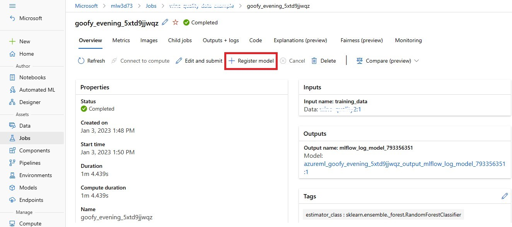
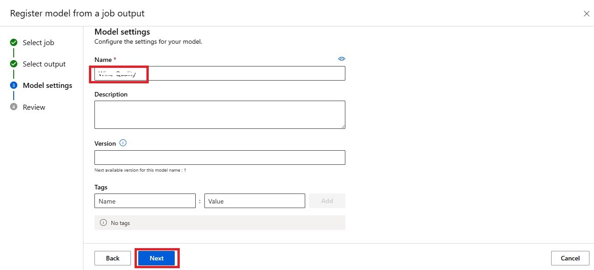
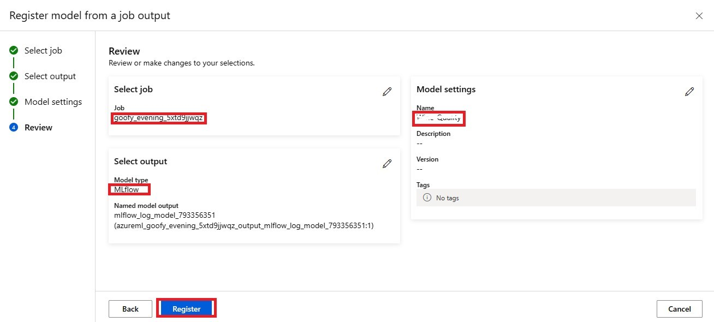
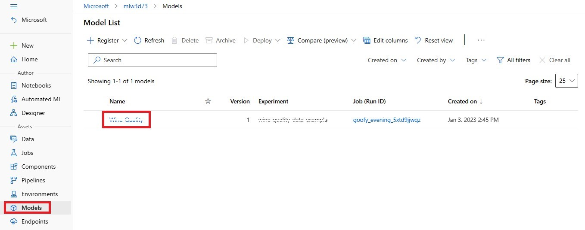
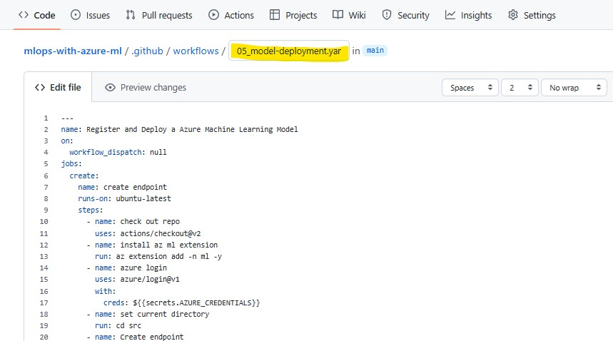
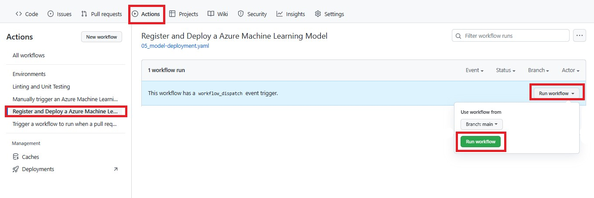
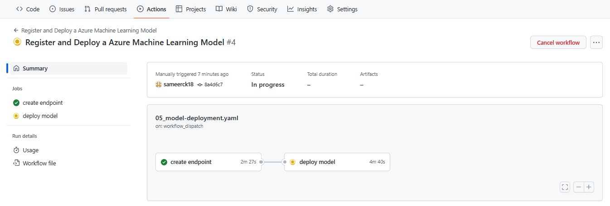
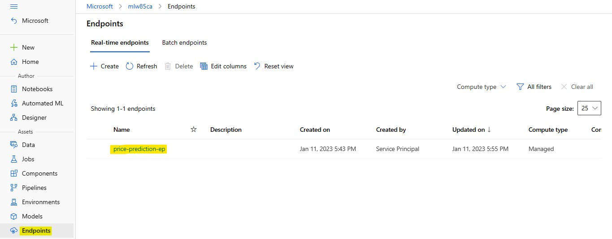

# Deploying a model with GitHub Actions

You can use the Azure Machine Learning CLI (v2) to deploy trained machine learning models automatically as part of machine learning operations (MLOps).

Using the Azure Machine Learning CLI (v2), you want to set up an automated workflow that will be triggered when a new model is registered. Once the workflow is triggered, the new registered model will be deployed to the production environment.

To get value from a machine learning model, you'll have to deploy it. Whenever you deploy a model you can generate predictions whenever necessary to give you insights.

In other words, you need to deploy the model to a real-time endpoint. The web app should be able to send the nyc taxi fare data to the endpoint and get a prediction in return.

When you want to deploy a model, you have a choice between an online endpoint for real-time predictions or a batch endpoint for batch predictions. As the model will be integrated with a web app where the you will input taxi fare data expecting to get a direct response, you choose to deploy the model to an online endpoint.

You can deploy the model manually in the Azure Machine Learning workspace. However, you expect to deploy more models in the future. And you want to easily redeploy the nyc taxi data model whenever the model has been retrained. You therefore want to automate the model deployment wherever possible.

## Prerequisites

- Azure Subscription
- GitHub Account
- Azure Machine Learning Workspace

## Learning objectives

- Package and register the model.
- Create an endpoint and deploy the model
- Trigger model deployment with GitHub Actions

## Exercise 1: Package and register the model

Whenever you want to deploy a model with the Azure Machine Learning workspace, you'll need to save the model's output and register the model in the workspace. When you register the model, you specify whether you have an MLflow or custom model.

When you register the model as an MLflow model, you can opt for no-code deployment in the Azure Machine Learning workspace. when you use no-code deployment, you don't need to create the scoring script and environment for the deployment to work.

To log your model with MLflow, enable autologging in your training script by using mlflow.autolog().

When you log a model during model training, the model is stored in the job output. Alternatively, you can store the model in an Azure Machine Learning datastore.

To register the model, you can point to either a job's output, or to a location in an Azure Machine Learning datastore.

1. Go to Azure ML workspace, navigate to **Jobs** > **All jobs** and select the latest successfull job run from previous lab step. 

    
    
2. Select **➕Register model**. Select ```MLflow``` as **Model type** and leave **Job output** as default. Click **Next**.

    
    
    

3. Give **Name** as ```Taxi-Data``` and Click **Next**.

    
    
4. Review and Select **Register**.

    

5. Navigate to **Models** to view the model.

    

## Exercise 2: Create an endpoint and deploy the model

To deploy the model to an endpoint, you first create an endpoint and then deploy the model. An endpoint is an HTTPS endpoint that the web app can send data to and get a prediction from. You want the endpoint to remain the same, even after you deploy an updated model to the same endpoint. When the endpoint remains the same, the web app won't need to be updated every time the model is retrained.

You'll learn how to use a managed online endpoint for real-time predictions.

#### Real-time predictions

To get real-time predictions, you can deploy a model to an endpoint. An endpoint is an HTTPS endpoint to which you can send data, and which will send an almost immediate response back.

New data will be the input, for the scoring script hosted on the endpoint. The scoring script loads the trained model to predict the label for the new input data, which is also known as inferencing. The label is then part of the output that is sent back.

#### Managed online endpoint

Within Azure Machine Learning, you can create a managed online endpoint. When using a managed online endpoint, you won't have to worry about infrastructure management.

All you need to do for the underlying infrastructure, is specify the VM type and scale settings. Everything else, like provisioning the compute and updating the host OS will be done automatically for you.

#### Create an endpoint

Create an endpoint:

Include the following parameters in the YAML configuration to create a managed online endpoint:

- name: Name of the endpoint. Must be unique in the Azure region.
- traffic: (Optional) Percentage of traffic from the endpoint to divert to each deployment. Sum of traffic values must be 100.
- auth_mode: Use key for key-based authentication. Use aml_token for Azure Machine Learning token-based authentication.

For example, to create a key-based authenticated endpoint, use this YAML configuration:

```yaml
$schema: https://azuremlschemas.azureedge.net/latest/managedOnlineEndpoint.schema.json
name: mlflow-endpoint
auth_mode: key
```

1. Goto your GitHub Repo, inside ```src``` folder create a yaml file with name ```create-endpoint.yaml``` and paste the above configuration and Commit.

    
    
    

#### Deploy a model to an endpoint

To deploy a model, you must have:

- Model files stored on local path or registered model
- Scoring script
- Environment
- Instance type and scaling capacity
  - instance_type: VM SKU that will host your deployment instance.
  - instance_count: Number of instances in the deployment.

When you deploy a MLflow model to a managed online endpoint, you don´t need to have the scoring script and environment.

To define the deployment for a MLflow model, use a YAML configuration like this:

```yaml
$schema: https://azuremlschemas.azureedge.net/latest/managedOnlineDeployment.schema.json
name: mlflow-deployment
endpoint_name: price-prediction-ep
model: azureml:<Model name>
instance_type: Standard_DS2_v2
instance_count: 1
```

In this example, we're taking the model which you registered in Exercise 1. For ```<Model name>``` goto Azure ML workspace, select the model you registered and copy the name.

    

1. Goto your GitHub Repo, inside ```src``` folder create a yaml file with name ```mlflow-deployment.yaml``` and paste the above configuration by replacing ```<Model name>``` with the model name from Azure ML workspace and Commit.

    
    
    

## Exercise 3: Trigger model deployment with GitHub Actions

To trigger the model deployment with Github actions, you need to create a workflow that has two jobs: Creating endpoint and Deploying model to the endpoint.

Please cross-check the **endpoint** name you give in ```mlflow-deployment.yaml``` and ```05_model-deployment.yaml```. It should be unique and same in both files..

1. Goto your GitHub Repo, inside ```.github/workflows``` folder create a yaml file with name ```05_model-deployment.yaml``` and paste the below code by replacing ```<rg-name>``` with your resource group name and ```<ml-workspace-name>``` with your Azure ML workspace name and Commit.

    

    ```yaml
    ---
    name: Register and Deploy a Azure Machine Learning Model
    on:
      workflow_dispatch: null
    jobs:
      create:
        name: create endpoint
        runs-on: ubuntu-latest
        steps:
          - name: check out repo
            uses: actions/checkout@v2
          - name: install az ml extension
            run: az extension add -n ml -y
          - name: azure login
            uses: azure/login@v1
            with:
              creds: ${{secrets.AZURE_CREDENTIALS}}
          - name: set current directory
            run: cd src
          - name: Create endpoint
            run: az ml online-endpoint create --name price-prediction-ep -f src/create-endpoint.yaml --resource-group <rg-name> --workspace-name <ml-workspace-name>
      deploy:
        name: deploy model
        needs: create
        runs-on: ubuntu-latest
        steps:
          - name: check out repo
            uses: actions/checkout@v2
          - name: install az ml extension
            run: az extension add -n ml -y
          - name: azure login
            uses: azure/login@v1
            with:
              creds: ${{secrets.AZURE_CREDENTIALS}}
          - name: set current directory
            run: cd src
          - name: deploy model
            run: az ml online-deployment create --name mlflow-deployment --endpoint price-prediction-ep -f src/mlflow-deployment.yaml --resource-group <rg-name> --workspace-name <ml-workspace-name> --all-traffic
    ```

2. Goto your Github repo and navigate to Actions and select ```Register and Deploy a Azure Machine Learning Model``` workflow. Select **Run workflow**.

    
    
3. You can two jobs running. One for creating endpoint and another for deploying the model.

    
    
4. Goto your Azure ML workspace to check the endpoint created and model deployed to it.

    
    
    

